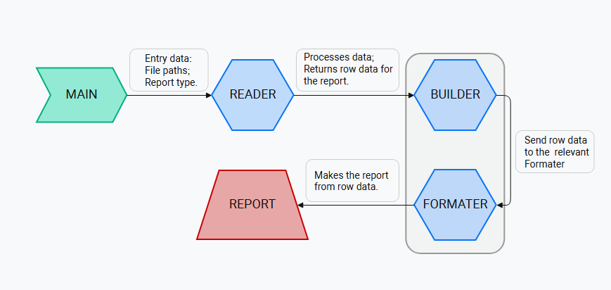
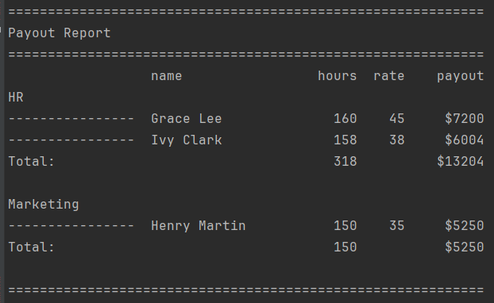

# Report Builder

**Short description:**  
The application builds structured reports from CSV files by reading, validating, and transforming raw employee data.

---

## Features

- Reads and parses CSV files with employee payout data
- Validates file headers and report type
- Groups and structures data by department into the row Dict
- Generates formatted payout report

---

## Block diagram of the application



---

## How to launch the App

1. Make sure **Python 3.10+** is installed
2. Clone this repository from GitHub
3. Place your CSV files into the `/files_for_processing` directory
4. Run the app using the following command in your terminal: 

```bash
python main.py -F data2.csv -R payout
```

---

**Sample Output**

